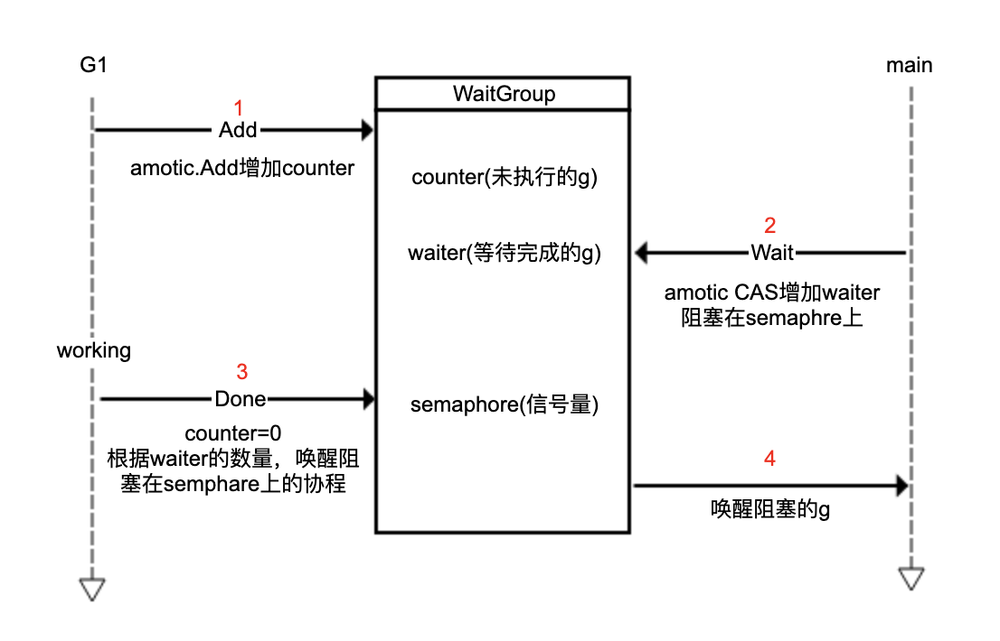

golang提供了比较便捷的并发编程方式。golang的并发单元是goroutine。在写代码时，有时goroutine在执行时自身独立且不需要与其他goroutine同步，时常也会遇到利用goroutine并发处理任务的情况。这时就需要多个goroutine之间进行同步。目前实现多个goroutine同步的主要方式有： sync包， channel，context包。

### sync.WaitGroup

标准库sync里的Waitgroup，用来阻塞主协程去等待所有协程执行完。WaitGroup主要三个方法：Add方法添加等待的协程数量，Done方法等于Add(-1)减少等待的协程数量，Wait方法阻塞主协程。原理示意图如下：

