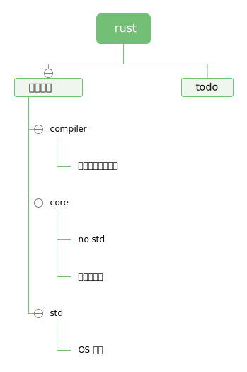
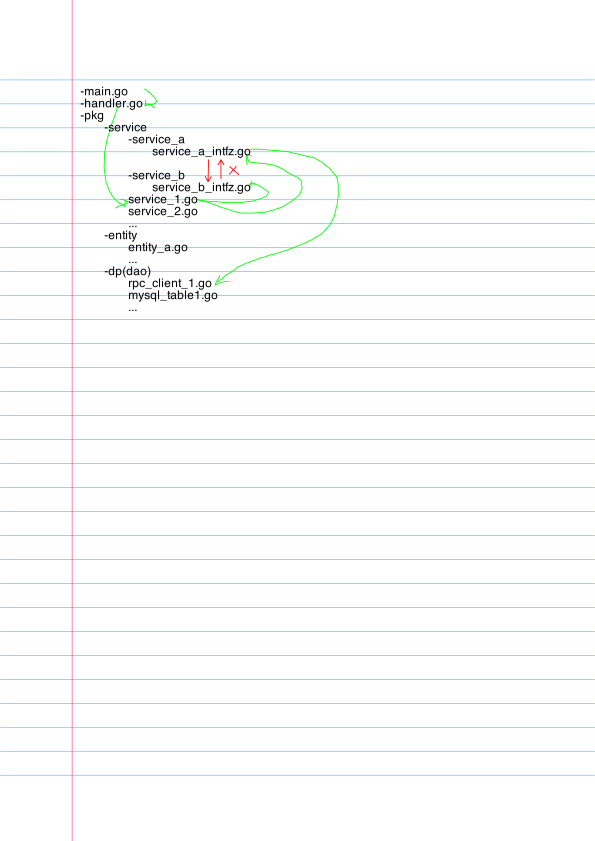

### doc book

rustup docs --book

### 源码结构



### 引入第三方依赖

例如在toml文件中引入rand crate后，cargo build的输出，Cargo.lock的内容。

### module

package， crate， module。

模块机制: rust的mod即是命名空间。

use 是optional，可以使用full path 替换，不是必须使用的。

use作用：将其他module的item导入到current namespace，方便访问。
不带{}的mod作用：将module的内容插入到当前file中。

声明：mod 与 pub mod

引入：use 与 pub use

### rust workspace 


<!--  -->

### 

vim nano

---


+ 所有权与借用， 生命周期

+ ownership, borrowing

```rust
fn main() {
    {
        let s1 = String::from("hallo");
        let s2 = s1;
        println!("{},{}", s1, s2); // error[E0382]: borrow of moved value: `s1`.
    }
    {
        let s1 = String::from("hallo");
        let s2 = s1.clone();  //
        println!("{}, {}", s1, s2);
    }
   {
       //reference
       let s1 = String::from("hallo"); // s1 is the owner of data 'hallo'.
       let s2 = &s1;  // s2 is a reference which points to the same data.
       println!("s1={}, s2={}", s1, s2);
   }
   {
       let s1 = String::from("hallo");
       let s2 = &s1; 
       let s3 = &s2; // two readonly reference of 'hallo'
       println!("s1={}, s2={}", s1, s2);
       println!("s3={}, len={}", s3, s3.len());
   }
   {
       //change string
       let mut s1 = String::from("hello"); // mutable borrow
       let s2 = &mut s1;  // mutable borrow occurs
       s2.push('~');
       println!("s2 = {}", s2);  // s2 = hello~
       // can only use the original when the borrowed item is dropped.
       // s2 is dropped, so s1 can use.
       println!("s1 = {}", s1);  // s1 = hello~  
   }
    {
       let mut s1 = String::from("hello"); // mutable borrow
       let s2 = &mut s1;  // mutable borrow occurs
       s2.push('~');
       println!("s2 = {}", s2); 
       println!("s1 = {}", s1); // not compile!
       s2.push('~') 
    }
    {
       let mut s1 = String::from("hello"); // mutable borrow
       let s2 = &mut s1;  // mutable borrow occurs
       s2.push('~');
       println!("s1 = {}", s1); // not compile!
       println!("s2 = {}", s2); 
    }
    {
        let mut words = vec![String::from("hallo"), String::from("español"), String::from("brett")];
        println!("{:?}", words);
        let t = words[1].clone();
        words[1] = words[2].clone();
        words[2] = t;
        println!("{:?}", words);
        // can't take two mutable loans from one vector,
        // just cast them to raw pointers to do the swap.
        words.swap(1, 2); // built-in swap function.
        println!("{:?}", words);
    }

    /*
    std::mem::swap(..) // use unsafe
    pub fn swap(&mut self, a: usize, b: usize) {
        unsafe {
            let pa: *mut T = &mut self[a];
            let pb: *mut T = &mut self[b];
            ptr::swap(pa, pb);
        }
    }
    */
}

```

### 智能指针

Deref trait,
```rust
pub trait Deref {
    type Target: ?Sized;
    fn deref(&self) -> &Self::Target;
}
```

 Drop trait

 

### closure

闭包相当于一个捕获变量的结构体，实现了 FnOnce 或 FnMut 或 Fn。

```rust
fn f<F: FnOnce() -> String>(g: F) {
    println!("{}", g());
}

let mut s = String::from("halo");
let t = String::from("world");

f(||{
    s += &t;
    s
});

```

```rust
struct Closure<'a>{
    s: String,
    t: &'a String,
}

impl <'a> FnOnce<()> for Closure<'a> {
    type Output = String;
    fn call_once(self) -> Output{
        self.s += &*self.t;
        self.s
    }
}
f(Closure{s: s, t: &t});

```


+ 模式匹配

+ 宏