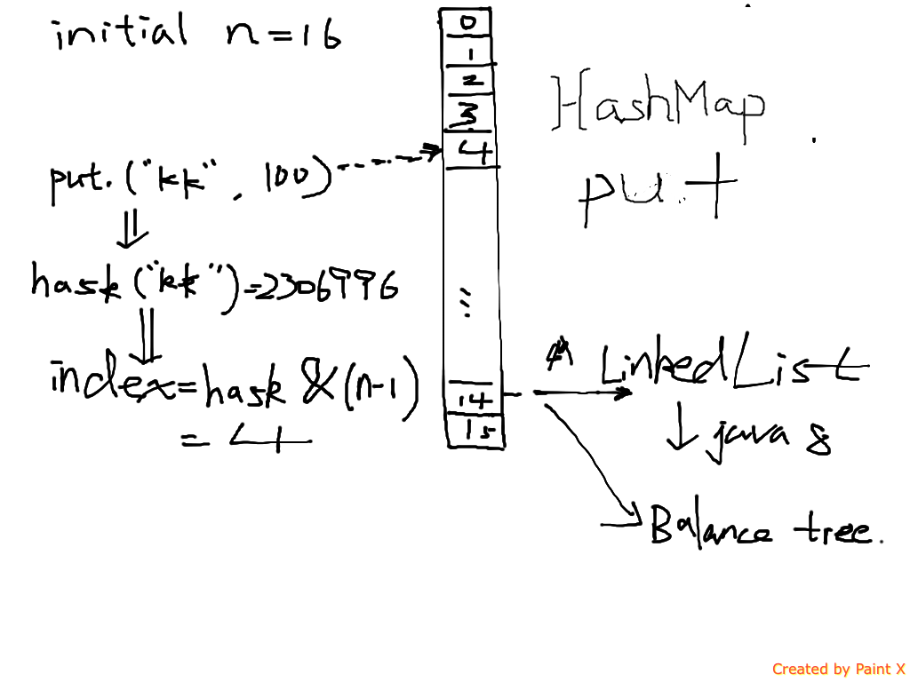

+ hashmap为什么不是线程安全的
  + 多线程修改时，fast-failed
  + resize时，get操作产生死循环
  + 一次时put时获取头节点为A，修改时时间片到期，另一个线程put了一个新的头节点B，第一次的线程会修改B节点的信息

+ put过程
  + 允许key为null，null值无法计算hashcode， put时特殊处理放在table[0]处
  + table数组为空时，resize扩容
  + 根据key的hashcode，去高16位 & （length-1）为 数组的索引位置
  + 比较元素是否相同，相同则修改覆盖； 不同则根据头结的类型看是否为TreeNode，以红黑树的方式遍历插入，或者遍历链表插入到尾部
  + modcount++, fast fail机制
  + 插入成功后，判断size是否大于阈值，大于则进行扩容
----
+ 扩容过程
  + 经过rehash之后，元素的位置要么是在原位置，要么是在原位置再移动2次幂的位置
---
+ HashMap 扩容时，size增大一倍， newsize=oldsize*2
+ ArrayList（动态数组）扩容时，扩大0.5倍，newsize=oldsize*1.5
+ ArrayQueue， 当size小于64时，+2；size大于64时，newsize=oldsize*1.5

---
+ hash算法采用2的指数容量，可以最大避免碰撞几率
  + 当容量为16时， elem & （1111） = elem （indexFor 保留位上的信息）
  + 当容量位15时，elem & （1110） = elem - 1 （可能流失最后一位的1信息）
----

+ 选什么类型的元素作为key
  + String，Integer类型的
  + Immutable类型， 规范的复写了hashCode 和 equals 方法

+ 如何自实现一个Immutable类
  + class定义为final，避免继承
  + 所有成员熟悉定义为final
  + 构造函数不要引用外部对象，构造时深度拷贝
  + 其实在类加载是可以做任何字节码修改
+ 判断一个类是否是Immutable的

---

+ 如何衡量hash算法的好坏
  + 避免冲突，hashcode需要尽可能的均匀分散
  + 快速给出hash码
  + 逆向困难
+ 常用hash算法
  + mod 取余数
  + MurMurHash
  + 一致性哈希
    + ketama

---
+ 没有GC时，如何实现HashMap
  + redis本质类似HashMap，数据到期失效删除

---
+ ConcurrentHashMap
  + 锁分段，缩小了锁的范围
  + 读不需要加锁
    + value为volatile变量，根据happen-before语义，它是当前最新的值
  + 迭代器是强一致的，还是弱一致的？
    + 弱一致性，
  + size 方法不能精确获取容器的大小
    + 如何精确获取容器的size？
    + 尝试2次，第一次CAS获取size，第二次在获取size，若没有变化则返回；否则加锁统计
