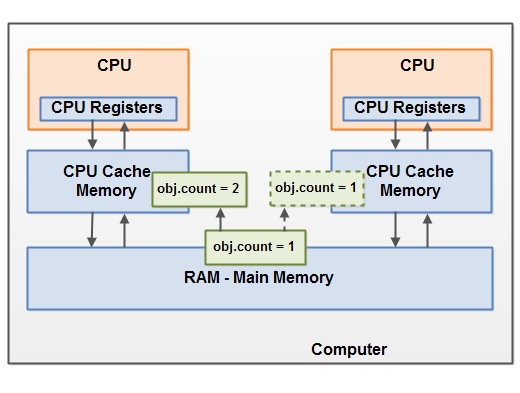

+ java memory model
  + the internal java memory model
  + hardware memory architecture
  + bridging the gap between JMM and hardware memory architecture
    + visibility of shared object (最重要是保证线程间写操作的可见性)
    + race conditions

[reference](http://tutorials.jenkov.com/java-concurrency/java-memory-model.html)

----

+ the internal java memory model


```
public class MyRunnable implements Runnable() {

    public void run() {
        methodOne();
    }

    public void methodOne() {
        int localVariable1 = 45;

        MySharedObject localVariable2 =
            MySharedObject.sharedInstance;

        //... do more with local variables.

        methodTwo();
    }

    public void methodTwo() {
        Integer localVariable1 = new Integer(99);

        //... do more with local variable.
    }
}
public class MySharedObject {

    //static variable pointing to instance of MySharedObject

    public static final MySharedObject sharedInstance =
        new MySharedObject();


    //member variables pointing to two objects on the heap

    public Integer object2 = new Integer(22);
    public Integer object4 = new Integer(44);

    public long member1 = 12345;
    public long member1 = 67890;
}

```

+ hardware memory architecture


+ bridge the gap


1 对共享对象的修改可见 volatile 实现



2 对临界区域的互斥访问 synchronized


