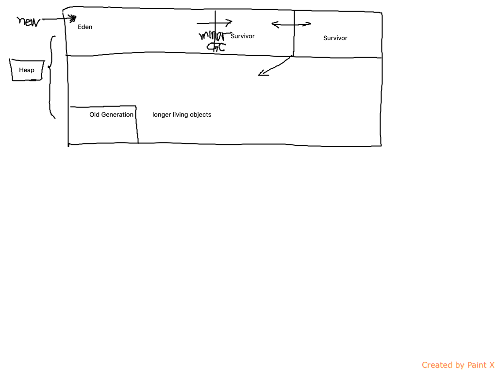

+ 一个快 low latency
+ 所有快 high throughput

+ performance considerations
  + jvm is virtual , not physical
    + conversion from bytecodes to native instructions and library calls
    + Interpreted mode, Just in Time(JIT) compilation
  + automatic memory management
    + new operator allocates space for an object
    + GC
    + no explicit pointer maipulation(safer)
  + Multi-thread
    + each object has a single monitor
    + locking

