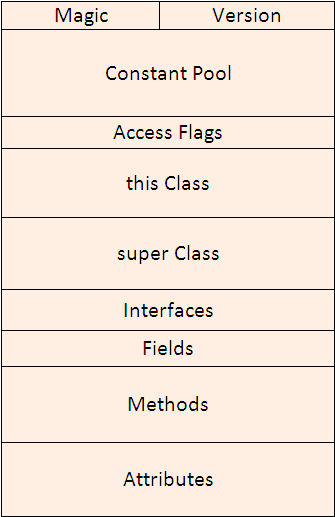
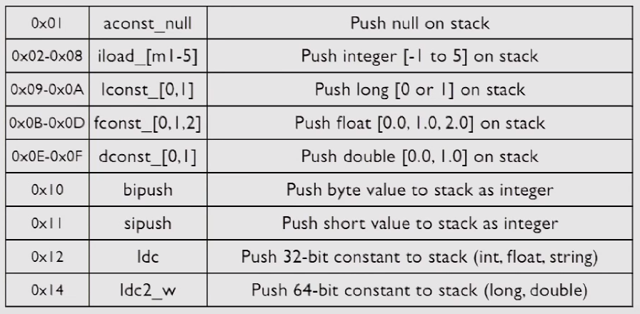
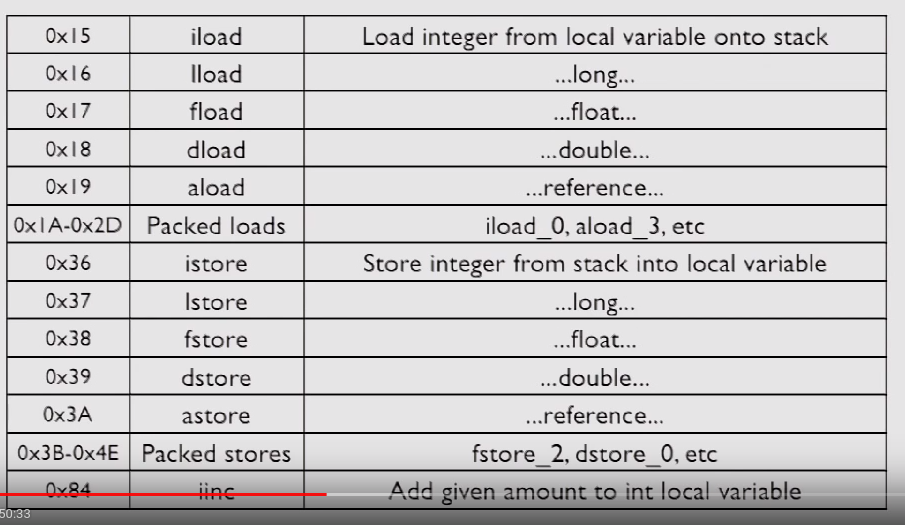

+ JVM Bytecode for Dummies
  + one-byte instructions
  + 256 possible "opcodes", 200 use in current JVM, https://en.wikipedia.org/wiki/Java_bytecode_instruction_listings
+ why learn it
  + full understand from top to bottom
  + bytecode generation is fun and easy
  + read bytecode (many lib generate bytecode)

---
+ javap
  + a java class file disassembler （javap是class文件的反编译器）
  + show class structure
    + Methods, superclass, interface, etc
  + -c flag includes bytecode (包含字节码)
  + -public, -private, -protected
  + -verbose for stack size, locals, args
+ javap -verbose xx.Class
+ use vim to show hexadecimal of xx.class
  + :%!xxd to show hexdecimal
  + :%!xxd -r to exit

---
Class文件格式图


魔数：标示文件格式，0x CA FE BA BE

version: jdk 版本

常量池：类名，方法名，变量名， 字符串常量等

access flags: clz是abstract, static ,etc

this class: 当前类的名称， super class: 父类的名称， interfaces： 实现的接口列表

属性： 类中定义的属性， 方法： 类中定义的方法，不包含继承而来的方法

附加属性： 源文件的名称，etc


```

result: javap HelloWorld
Compiled from "HelloWorld.java"
public class HelloWorld extends java.lang.Object {
  public HelloWorld();
  public static void main(java.lang.String[]);
}

command: javap -c HelloWorld
command: javap -c -verbose HelloWorld

```
-----

+ biteScript
  + JRuby(DSL), 生成字节码， 读起来想javap -c(可读性更好)
  + http://github.com/headius/bitescript

------

+ 字节码基本操作
  + 栈操作 stack manipulation
    + 0x00 -> nop(do nothing), 0x57 -> pop, etc...
    + dup_x1, dup2_x2
  + local variables
  + Math
  + boolean
+ 一个操作符 = <type><operation>
  + 栈中变量的类型
    + prefix（操作符的前缀标示）， b-byte, i-int, a-reference
    + the prefix is representative of the type of data is being manipulated
      + a, aload, manipulate an object reference
      + i, iload, manipulate an integer,etc, b-byte, c-char, d-double...
  + 具体操作
    + Constant values
    + Local vars(load, store)
    + 数组操作（aload, astore）
    + 数据操作（add, sub, mul, div）
    + boolean and bitwise
    + Comparisons
    + Conversions
----

+ constant values
  + push constant values to stack
  + like 0x12->ldc, etc...



----
+ Local Variables
  + iload, load integer from local variable onto stack
  + istore, store integer from stack into local variable
    + istore_0, 1,2,3只能取这几个值； 若存放在局部变量表中的位置大于3时， istore x需要指定x


-----
+ Arrays
  + newarray int


-----  
+ Flow Control

+ using classes


---
+ invoke dynamic
  + invokestatic 调用静态方法
  + invokespecial 调用实例构造方法init， 私有方法， 父类方法 (下面是虚方法的调用，上面不是)
  + invokevirtual 调用虚方法 （java中override， 重写的本质）
    + 在运行该字节码时，栈顶获取对象的实际类型
    + 方法去中建立虚方法表， 提高方法查询性能。 虚方法表中存放各方法的实际入口地址，子类没有重写，表中方法的地址与父类一致
  + invokeinterface
  + invokedynamic
+ Synchronization
    + 0xC2, monitorenter, enter synchronized block against object on stack
    + 0xC3, monitorexit, exit syhchronized block against same object
+ jvm opcodes    
+ java virtual machine specification

----

+ JVM JIT for Dummies
  + how Hotspot's JIT works
  + how to monitor the JIT
  + how to find problems
  + how to fix problems

+ Hotspot
    + client mode - c1
      + less aggressive, fewer optimized
    + server mode - c2
      + aggressively, based on richer runtime profiling

+ C2 compiler
  + profile to find "hot spots"
    + call sites
    + branch statistics
    + profile until 10k calls
  + inline mono/bimorphic calls
  + other mechanisms for polymorphic calls
+ Monitoring the JIT
  + Dozens of flags
  + Reams of output
  + Always evoling
  + understand it
+ Print Compilation
  + -XX:+PrintCompilation
  + Print methods as they JIT
    + class + name + size
---
+ GC tuning
+ visualgc
+ OpenJDK
+ JNI
