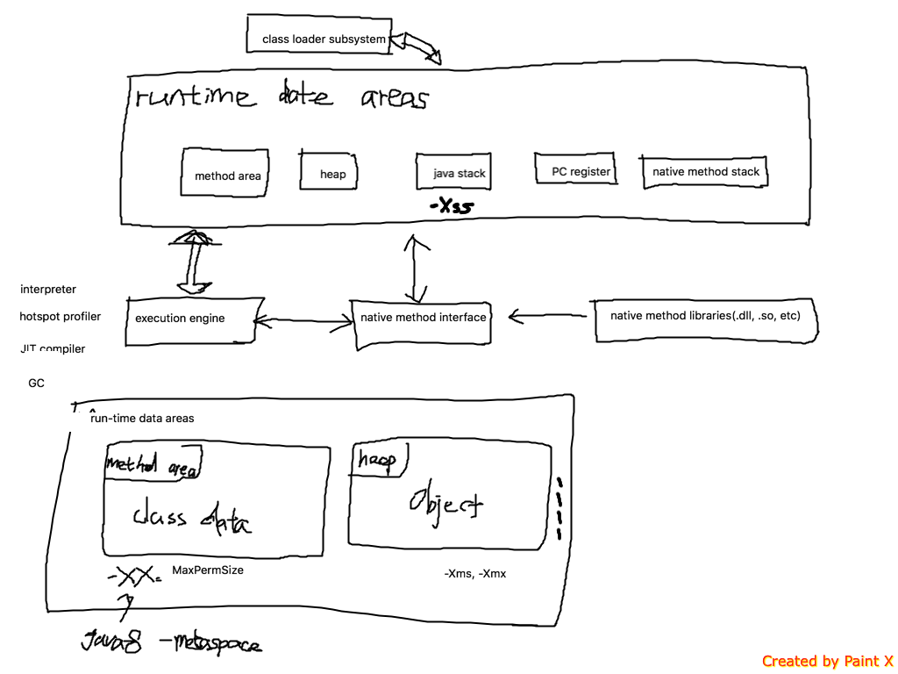

### read jvms8 and write some notes here

+ what is the difference between JDK, JRE and JVM, JIT
  + JIT is in JVM
  + jvm + library classes = JRE
  + JRE + development tools = JDK
---
+ 1 overview



---

+ 2 structure of the java virtual machine

---

+ 3 compiling for the java virtual machine

  + format of examples

  + use of Constands, Local Variables, and Control COnstructs
    + jvm operate on values popped from operand stack rather than directly from local variables
    + istore_1 means: pop int 1 from operand stack and then store in local variables 1
    + iload_1 means: push the value in local variable 1 into operand stack

  + receiving arguments
    + static method's arguments start in local variable 0, rather than 1
      + static method do not have an instance
    + an instance method' arguments start in local variable from 1 to n
      + local variable 0 store the reference(this)

  + invoking methods
    +
  + arrays
    + newarray
    +
---

+ 4 class file format
  + define own set of data types to represent the class file data
    + u1, u2, u3, u4: unsigned 1, 2, 3, 4 byte.


+ constant pool
  + jvm instructions refer to symbolic info in constant_pool table

```
cp_info {
  u1 tag;
  u1 info[];
}
```  

---


+ field

```
field_info {
  u2 access_flags;
  u2 name_index;
  u2 descriptor_index;
  attribute_info attributes[attributes_count];
}
```

+ method

---
+ 5 Loading, Linking and initializing

---

+ 6 the java virtual machine instruction set

---

排除法  控制变量法 

over 

+ java进程的内存结构
+ class文件结构
  + javap -verbose a.class
    + 常量表
    + 属性表
+ 类加载机制
+ 字节码执行引擎
+ javac编译，java运行优化
+ 线程


---
分布式服务架构：原理、设计与实战

+ jvm提供的监控命令
  + jad 反编译工具
  + btrace
  + jmap 查看java进程对内存的使用情况
  + jstat 实时监控
  + jstack 给定java进程Id的线程堆栈快照信息
  + jinfo java进程的环境变量和虚拟机变量
  + 其他命令
    + javap
    + javah
    + jps = ps -elf | grep java
    + jdb
+ linux command
  + grep
  + find . -name file_name
  + lsof
    + lsof -p 2300 查看某个进程打开的文件句柄
    + lsof -i:8080
  + process
    + ps -elf 显示所有进程
    + top 查看活动进程的cpu和内存情况
--
