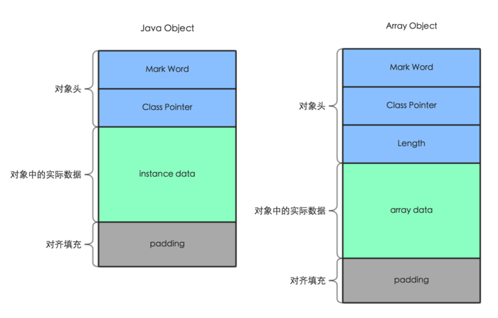

----
+ java类从字节码到JVM中使用( 框架-》字节码-》Class对象-》类的实例对象)
  + javac编译生成class文件（字节码文件）
  + 加载 ClassLoader （类加载器在堆上生成Class<A>对象）
  + 链接
  + 初始化
    + static block  
  + Class<A>对象可以生成A类的实例对象
+ 生成字节码的框架
  + javassit，cglib，asm
+ 读和写字节码
  + 一个CtClass对象 - 对应Class对象
  + ClassPool是由CtClass对象组成的hashtable
    + obtain from ClassPool
---

一个对象在内存中的结构

对象头由2部分组成 - mark word（32位或者64位）： 25bit 哈希码，2bit 锁标志位 ； 二  类型指针（指向Class对象）

在对象上加锁的过程
+ 复制对象头到执行栈中的锁记录中
+ 修改对象头中的mark word， 2点修改：修改mark word的前30bit为存放锁记录的地址，修改锁标志位
